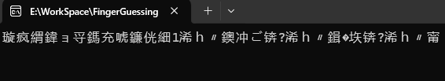

# 猜拳游戏
### Linux食用指南 
为取得最佳效果，你需要一路CD到存放本源码的文件夹，然后执行以下命令
>g++ main.cpp -o FingerGuessingGame -Ofast

然后
>./FingerGuessingGame

然后用./CircleCaculator打开程序
### Windows 用户必看
使用Microsoft Visual Studio调试本程序

你可能会遇到编译完此程序后部分单文字显示错误，比如  
>在解决方案下面一行点右键→属性→平台工具集选择clang  

在*mian.cpp*第5行添加
>system("chcp 65001");

### 耍赖
在你出拳之后可以耍赖，使得电脑方可见，自己则随机出拳

